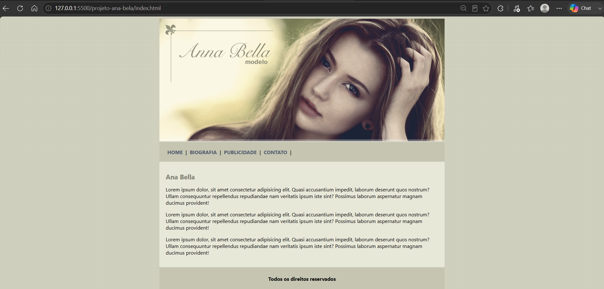

# 🎨 CSS Learning

> Repositório dedicado ao estudo de CSS, reunindo exercícios, exemplos práticos e pequenos projetos desenvolvidos durante minha jornada de aprendizado.

---

## 📖 Sobre

Este repositório foi criado para documentar minha evolução no CSS através de exercícios e projetos práticos.

Todo o conteúdo é desenvolvido conforme avanço nos estudos, servindo como material de consulta e também como demonstração da minha evolução como desenvolvedor Front-end.

---

## 🚀 Projeto em destaque

### Site com Navegação

**Descrição:**
Estrutura desenvolvida para aplicar os principais conceitos estudados até o momento,
com exemplo de um site construido para um portfólio de modelo fotográfica.

### 📸 Preview

<p align="center">
    
</p>

### 🎥 Demonstração

<p align="center">
    
</p>

### Conceitos aplicados

- Estrutura HTML5
- Seletores CSS
- Classes e IDs
- Box Model
- Margin e Padding
- Borders
- Backgrounds
- Navegação entre páginas

---

## 📚 Conteúdos abordados

- Estilos e alinhamentos
- Fontes e cores
- View width e View height
- Seletores CSS
- Classes e IDs
- Herança
- Especificidade
- Box Model
- Margin e Padding
- Borders
- Backgrounds
- Unidades de medida
- Pseudo-classes
- Pseudo-elementos

> Novos conteúdos serão adicionados conforme avanço nos estudos.

---

## 📂 Estrutura do repositório

```text
CSS3/
│
├── css/
├── desafios/
├── html/
├── img/
├── projeto-ana-bela/
├── README.md
└── ...
```

---

## 🛠 Tecnologias

- HTML5
- CSS3
- Git
- GitHub
- VsCode

---

## 🎯 Objetivo

Consolidar os fundamentos do CSS através de exercícios e projetos práticos, documentando minha evolução e construindo uma base sólida para o desenvolvimento Front-end.

---

## 👨‍💻 Autor

**Lindomar Coelho Possolo Júnior**

Estudante de Engenharia de Software.

GitHub:
https://github.com/Lindomar-Jr
